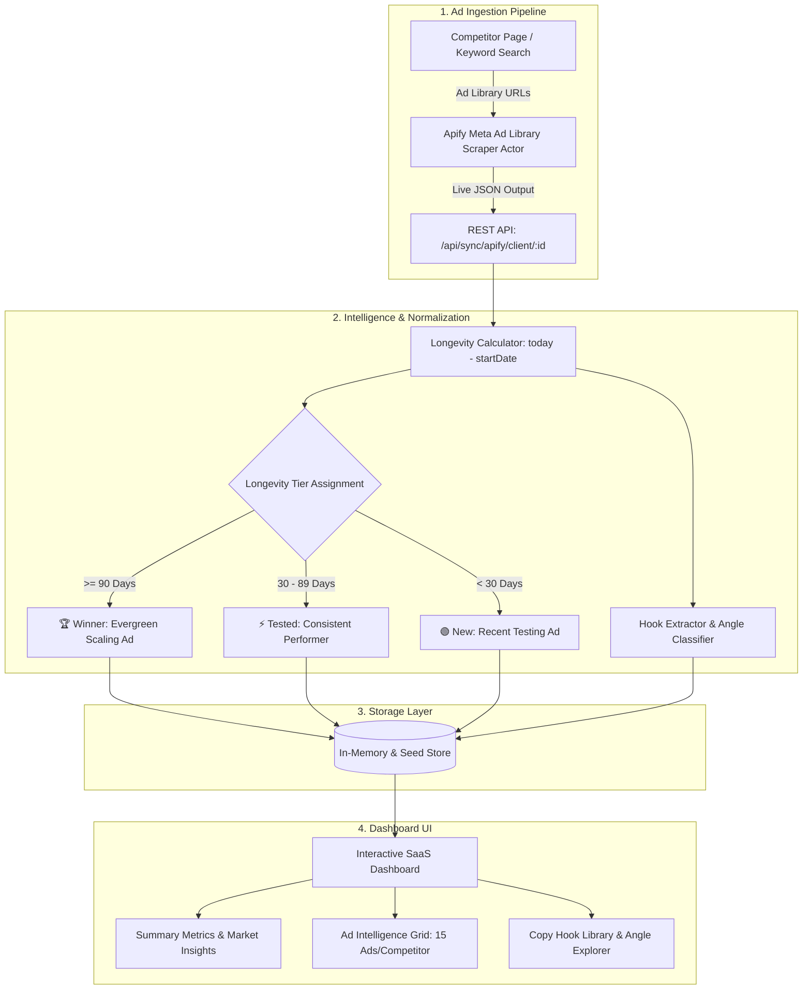

# ⚡ Multi-Client Competitor Intelligence & Ad Swipe Engine

[](https://nodejs.org/)
[](https://expressjs.com/)
[](https://apify.com/)
[](LICENSE)

An enterprise-grade, multi-client **Meta Ad Library Competitor Intelligence & Ad Swipe Engine**. Designed for high-performance media buying teams, digital marketing agencies, and growth hackers to automate competitor ad tracking, identify scaling winner creatives, deconstruct copywriting hooks, and discover proven conversion angles.

---

## 🎯 Key Capabilities

* **🏢 Multi-Tenant Client Workspaces:** Partition competitor tracking by distinct client accounts or business verticals with instant client-switching tabs.
* **🤖 Automated Meta Ad Library Scraping (Apify):** Ingests live ad creatives, primary copy, headlines, formats (Video / Image / Carousel), and exact delivery start dates directly from Meta's Ad Library.
* **🏆 Automated Winner Ad Detection (>90 Days Active):** Automatically flags ads that have survived multi-month testing and are running continuously (proven high-ROAS, profitable evergreen winners).
* **🧠 Copywriting Hook Deconstruction:** Isolates the top 1–2 scroll-stopping lines from ad copy into a standalone, searchable Hook Library.
* **📐 Marketing Angle Classification:** Categorizes creative angles (*Social Proof*, *Fear / Problem Agitation*, *Speed & Value*, *Micro-Tripwire Offers*, *Curiosity*, and *Authority*).
* **⚡ Webhooks & Scheduled Automation:** REST API endpoints to receive automated runs from Apify actors, Make.com, Zapier, or cron tasks.
* **📥 CSV Export:** One-click CSV export of ad copy, hooks, angles, and live Meta Ad Library URLs for media buyers and creative teams.

---

## 📐 Architecture Overview



---

## 📁 Repository Structure

```text
Dashboard/
├── backend/
│   ├── controllers/
│   │   ├── adController.js          # Ad CRUD operations
│   │   ├── clientController.js      # Client workspace management
│   │   ├── competitorController.js  # Competitor management
│   │   └── syncController.js        # Apify auto-sync & webhook ingestion controller
│   ├── data/
│   │   └── seedData.js              # Multi-client pre-seeded datasets (15 ads/competitor)
│   ├── routes/
│   │   └── api.js                   # Express REST API route definitions
│   ├── services/
│   │   ├── apifyService.js          # Apify actor runner, winner detection & hook classifier
│   │   └── dbService.js             # Data service (in-memory store)
│   └── server.js                    # Express backend application instance
├── frontend/
│   ├── css/
│   │   └── style.css                # Polished SaaS styling, cards, badges & responsive grid
│   ├── js/
│   │   └── app.js                   # Reactive state, tabs, filter pills & API handlers
│   └── index.html                   # Main dashboard web app (redirects /Swipe-Dashboard.html)
├── .env.example                     # Environment template for local & production
├── .gitignore                       # Production gitignore (strictly ignores secrets & logs)
├── .dockerignore                    # Docker build exclusion rules
├── Dockerfile                       # Production-ready Node.js container definition
├── package.json                     # Node project manifest and dependencies
├── server.js                        # Root entry point
└── README.md                        # Production developer documentation
```

---

## 🚀 Quick Start (Local Development)

### 1. Prerequisites
* **Node.js**: v18.0.0 or higher
* **npm**: v8.0.0 or higher

### 2. Clone and Install Dependencies
```bash
git clone https://github.com/bs-hue/compititor-ad-analysis-.git
cd compititor-ad-analysis-
npm install
```

### 3. Environment Configuration
Create a `.env` file in the root directory by copying `.env.example`:
```bash
cp .env.example .env
```

Edit `.env` with your credentials:
```env
PORT=3000

# Apify Credentials (For live Meta Ad Library automated scraping)
APIFY_API_TOKEN=your-apify-api-token-here
APIFY_ACTOR_ID=curious_coder/facebook-ads-library-scraper
APIFY_MAX_ADS_PER_COMPETITOR=15
APIFY_AUTO_SYNC_HOURS=24
```

### 4. Start the Application
```bash
npm start
```
The dashboard is immediately accessible at:
* 🌐 **Dashboard UI:** [http://localhost:3000](http://localhost:3000)
* ⚡ **API Health:** [http://localhost:3000/api/health](http://localhost:3000/api/health)

---

## 🤖 Apify Integration & Automated Winner Ad Logic

### Supported Scraper Actor
The engine integrates with the [curious_coder/facebook-ads-library-scraper](https://apify.com/curious_coder/facebook-ads-library-scraper) actor (or any standard Meta Ad Library Apify actor).

### Ingestion Flow:
1. When you click **⚡ Auto-Sync Ads (Apify)** in the dashboard or call `POST /api/sync/apify/client/:id`:
2. The service sends a request to Apify with:
   ```json
   {
     "urls": [{ "url": "https://www.facebook.com/ads/library/?active_status=active&..." }],
     "count": 15,
     "limitPerSource": 15,
     "scrapeAdDetails": true
   }
   ```
3. The dataset items are fetched and normalized:
   * $\text{Days Active} = \text{Date.now()} - \text{startDate}$
   * $\ge 90 \text{ Days} \implies \text{Winner}$
   * $30 - 89 \text{ Days} \implies \text{Tested}$
   * $< 30 \text{ Days} \implies \text{New}$
4. Ads are upserted into the database and competitor benchmarks are updated automatically.

---

## 🌐 Production Deployment

### Option 1: Docker (Recommended)
Build and run the container:
```bash
docker build -t competitor-ad-intelligence .
docker run -p 3000:3000 --env-file .env competitor-ad-intelligence
```

### Option 2: Render / Railway / Heroku
1. Push this repository to GitHub.
2. In your cloud provider dashboard (e.g. Render/Railway), create a new **Web Service** connected to your repository.
3. Build Command: `npm install`
4. Start Command: `npm start`
5. Configure Environment Variables in the cloud dashboard matching `.env.example`.

### Option 3: Linux VPS (Ubuntu / Debian with PM2 & Nginx)
```bash
# 1. Install PM2 process manager
npm install -g pm2

# 2. Start application with PM2
pm2 start server.js --name "competitor-intelligence"

# 3. Setup PM2 system startup script
pm2 startup
pm2 save
```

---

## 📡 REST API Reference

| Method | Endpoint | Description |
| :--- | :--- | :--- |
| `GET` | `/api/health` | System health check & database connection mode |
| `GET` | `/api/apify/status` | Current Apify scraper engine configuration status |
| `POST` | `/api/sync/apify/client/:id` | Trigger live Apify scrape for all competitors in a client workspace |
| `POST` | `/api/sync/apify/competitor/:id` | Trigger live Apify scrape for a single competitor |
| `POST` | `/api/webhook/apify` | Ingest webhook payloads from Apify scheduled tasks / Make.com |
| `GET` | `/api/clients` | List all client workspaces with competitor counts |
| `POST` | `/api/clients` | Create a new client workspace |
| `GET` | `/api/clients/:id/overview` | Fetch client details, competitors, and all associated ads |
| `DELETE` | `/api/clients/:id` | Delete a client workspace and cascade associated records |
| `POST` | `/api/clients/:id/competitors`| Add a new competitor brand to a client |
| `DELETE` | `/api/competitors/:id` | Delete a competitor and its ads |
| `POST` | `/api/clients/:id/ads` | Manually log / swipe a new ad creative |
| `DELETE` | `/api/ads/:id` | Remove an ad from the swipe library |

---

## 📄 License
This project is licensed under the MIT License. See [LICENSE](LICENSE) for details.
